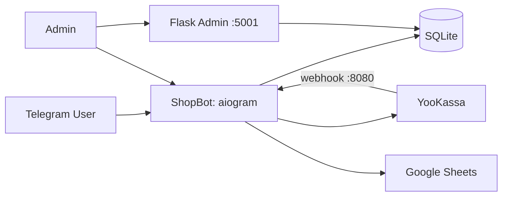

# ShopBot

[](https://www.python.org/downloads/)
[](https://docs.aiogram.dev/)
[](https://yookassa.ru/)
[](https://flask.palletsprojects.com/)
[](LICENSE)

**Telegram-магазин с каталогом, корзиной, оплатой YooKassa и Flask-админкой.**

| Паспорт | |
|---|---|
| **Уровень** | Level 1 — Simple bot (FSM/handlers, каталог и заказы, без LangGraph) |
| **Статус** | active |
| **Ценность** | Self-hosted приём заказов в Telegram: каталог, корзина, YooKassa, доставка, отзывы и веб-админка |
| **Актуализация README** | 2026-08-06 · см. [историю коммитов](https://github.com/kartuznik/shopbot/commits/main) |

Операции (systemd/Nginx deploy, backup/restore, ротация ключей, инциденты, rollback): [docs/RUNBOOK.md](docs/RUNBOOK.md).

---

## О проекте

**ShopBot** — portfolio / self-hosted MVP: Telegram-бот для онлайн-магазина с каталогом, корзиной, заказами, оплатой через YooKassa, зонами доставки, отзывами и веб-админкой на Flask. Деплой — **venv + systemd** (Docker Compose в репозитории нет).

### Что умеет

- Принимать заказы в Telegram (каталог, поиск, корзина, адреса, статусы).
- Собирать оплаты через YooKassa (создание платежа + webhook на `:8080`).
- Управлять ассортиментом, заказами, доставкой и рассылками из Telegram и веб-панели.
- Синхронизировать отчёты с Google Sheets (ручной и auto-sync).
- Экспортировать данные в CSV/Excel из веб-админки.
- Health-мониторинг (`/health`, journalctl, health-log).

### Чего не умеет (честный scope)

- Не multi-tenant SaaS и не enterprise IAM (SSO/SAML).
- Нет LangGraph / multi-agent и нет встроенного стека Prometheus + Grafana.
- Нет рекуррентных (подписочных) платежей «из коробки» — оплаты через YooKassa по сценарию заказа.
- Нет Docker Compose quick-start (см. systemd в [docs/RUNBOOK.md](docs/RUNBOOK.md)).
- Конкретные цены товаров/офферов в коммерческих материалах живут **вне** git.

### Поведение при сбоях (graceful degradation)

- **Webhook YooKassa недоступен / ошибка обработки:** событие логируется; создание платежа в чате показывает пользователю честную ошибку; заказ/каталог продолжают работать без подтверждения оплаты, пока webhook не восстановлен (Nginx → `127.0.0.1:8080`).
- **Сбой синхронизации Google Sheets:** ошибка ловится в sync-пути, пишется в лог; бот и магазин продолжают работу; ручной `/sheets_sync` можно повторить после починки `credentials.json` / прав таблицы.
- **Веб-админка недоступна:** процесс `shopbot-web` независим от бота — Telegram-магазин и webhook продолжают работать; админ использует Telegram-команды (`/admin`, `/health`) до восстановления панели `:5001`.
- **Telegram API / процесс бота:** health-monitor с retry backoff и алертами админам (по факту `bot/health.py`); сервисы поднимаются через systemd.

---

## Быстрый старт

```bash
git clone https://github.com/kartuznik/shopbot.git /opt/bots/shopbot
cd /opt/bots/shopbot
python3 -m venv venv
source venv/bin/activate
pip install -r requirements.txt
cp .env.example .env   # заполните токены и ключи
python -m bot.main     # терминал 1 — бот + webhook :8080
python -m web.app      # терминал 2 — админка :5001
```

База SQLite создаётся автоматически при старте бота (`DB_PATH`, обычно `data/shopbot.db`).

Продакшен-деплой через systemd и Nginx — в [docs/RUNBOOK.md](docs/RUNBOOK.md).

---

## Возможности

### Для клиента

- Каталог с категориями, поиском и карточками товаров.
- Корзина и оформление заказа.
- Выбор адреса и зоны доставки.
- Просмотр статусов заказов.
- Отзывы и рейтинги товаров.

### Для администратора в Telegram

- Управление товарами и категориями.
- Управление статусами заказов.
- Статистика продаж и пользователей.
- Управление зонами доставки.
- Просмотр платежей.
- Массовые рассылки.
- Google Sheets (ручной и auto-sync).
- Health-мониторинг (`/health`).

### Веб-админка (`:5001`)

- Авторизация по паролю из `.env` (`ADMIN_WEB_PASSWORD`).
- Дашборд с ключевыми метриками.
- CRUD по товарам, категориям, зонам доставки.
- Список заказов с фильтрацией и сменой статуса.
- Пользователи и история заказов.
- Отзывы и платежи.
- Экспорт в CSV/Excel; отчёты по продажам в Excel с графиком.
- Настройки — редактирование безопасных `.env` параметров.

---

## Архитектура



---

## Демо

Плейсхолдеры под скриншоты (владелец добавит файлы):

| Плейсхолдер | Сценарий |
|---|---|
| `docs/demo/01-catalog.png` | Каталог / карточка товара |
| `docs/demo/02-cart-checkout.png` | Корзина и оформление |
| `docs/demo/03-payment.png` | Оплата YooKassa |
| `docs/demo/04-admin-telegram.png` | Админ-команды в Telegram |
| `docs/demo/05-web-dashboard.png` | Веб-админка: Dashboard |
| `docs/demo/06-web-orders.png` | Веб-админка: Заказы / экспорт |

Живой демо-бот: ссылку на `@…` добавляет владелец после публикации.

---

## Требования

- Ubuntu/Debian VPS
- Python 3.11+ (рекомендуется 3.12+)
- `pip`, `venv`
- SQLite (встроен в Python)
- systemd
- Nginx (рекомендуется для reverse proxy webhook)

---

## Установка

### 1) Клонирование

```bash
git clone https://github.com/kartuznik/shopbot.git /opt/bots/shopbot
cd /opt/bots/shopbot
```

### 2) Виртуальное окружение

```bash
python3 -m venv venv
source venv/bin/activate
```

### 3) Зависимости

```bash
pip install -r requirements.txt
```

### 4) Настройка `.env`

```bash
cp .env.example .env
```

Обязательные/важные переменные:

| Переменная | Назначение |
|---|---|
| `TELEGRAM_BOT_TOKEN` | Токен бота от @BotFather |
| `ADMIN_IDS` | Telegram ID администраторов через запятую |
| `DB_PATH` | Путь к SQLite, обычно `data/shopbot.db` |
| `LANGUAGE` | Язык (`ru` или `en`) |
| `ADMIN_WEB_PASSWORD` | Пароль входа в веб-админку |
| `YUKASSA_SHOP_ID` | ID магазина YooKassa |
| `YUKASSA_SECRET_KEY` | Секретный ключ YooKassa |
| `WEB_PUBLIC_BASE_URL` | Опционально: публичный базовый URL вебки |

Значения секретов только в серверном `.env`, не в README.

### 5) Инициализация БД

База создаётся автоматически при старте бота.

---

## Запуск

### Telegram-бот

```bash
cd /opt/bots/shopbot
source venv/bin/activate
python -m bot.main
```

Webhook YooKassa слушает **`127.0.0.1:8080`** (внутри процесса бота; адрес и порт задаются `WEBHOOK_HOST`/`WEBHOOK_PORT`). Наружу его публикует только Nginx — bind на `0.0.0.0` обходит reverse proxy и запрещён.

### Веб-админка

```bash
cd /opt/bots/shopbot
source venv/bin/activate
python -m web.app
```

Веб-панель по умолчанию: `http://<YOUR_HOST>:5001` (подставьте свой host; IP в git не фиксируем).

---

## Настройка Telegram-бота

1. Откройте @BotFather.
2. Создайте бота: `/newbot`.
3. Скопируйте токен и добавьте в `.env` как `TELEGRAM_BOT_TOKEN`.
4. Добавьте ваш Telegram ID в `ADMIN_IDS`.
5. Перезапустите сервис бота.

## Настройка YooKassa

1. Зарегистрируйтесь в [YooKassa](https://yookassa.ru/).
2. Создайте магазин в кабинете.
3. Скопируйте `shop_id` и `secret_key`.
4. Запишите в `.env`:
   - `YUKASSA_SHOP_ID=...`
   - `YUKASSA_SECRET_KEY=...`
5. Настройте webhook URL через Nginx reverse proxy:
   - публично: `https://<YOUR_DOMAIN>/webhook/yookassa` (или `http://<YOUR_HOST>/webhook/yookassa` на этапе отладки);
   - внутренний upstream: `127.0.0.1:8080`.

## Настройка Google Sheets API

1. Создайте проект в Google Cloud.
2. Включите Google Sheets API и Google Drive API.
3. Создайте Service Account.
4. Скачайте JSON-ключ и сохраните как `/opt/bots/shopbot/credentials.json`.
5. Пример структуры ключа: `credentials_example.json`.
6. Добавьте email сервисного аккаунта в доступ нужной таблицы Google Sheets (Editor).
7. В боте выполните `/sheets_setup` для создания конфигурации синхронизации.

---

## Использование

### Команды пользователя

- `/start` — старт
- `/catalog` — каталог
- `/search <запрос>` — поиск товаров
- `/cart` — корзина
- `/orders` — мои заказы
- `/add_address` — добавить адрес
- `/my_addresses` — мои адреса
- `/reviews <product_id>` — отзывы о товаре

### Команды администратора

- `/admin` — админ-панель
- `/add_product`, `/edit_product`, `/delete_product`
- `/add_category`, `/list_categories`, `/delete_category`
- `/admin_orders`, `/order_status`, `/order_details`
- `/users`
- `/stats`, `/stats_sales`, `/stats_users`
- `/payments`, `/payment_details`
- `/broadcast`, `/broadcasts`, `/broadcast_details`, `/broadcast_cancel`, `/broadcast_delete`
- `/sheets_setup`, `/sheets_list`, `/sheets_sync`, `/sheets_delete`
- `/add_delivery_zone`, `/list_delivery_zones`, `/delete_delivery_zone`, `/delivery_stats`
- `/product_reviews`, `/delete_review`
- `/health`

## Веб-админка: разделы

- `Dashboard` — общая статистика
- `Товары` — управление товарами + экспорт
- `Категории` — создание и удаление
- `Заказы` — фильтры, статусы, детали, экспорт
- `Пользователи` — поиск и история заказов, экспорт
- `Доставка` — зоны доставки
- `Отзывы` — просмотр/удаление, экспорт
- `Платежи` — статусы оплат
- `Настройки` — редактирование безопасных `.env` параметров

## Экспорт данных

В веб-админке доступны:

- товары: CSV/Excel
- заказы: CSV/Excel (с фильтрами)
- пользователи: CSV/Excel
- отзывы: CSV/Excel
- продажи: Excel-отчёт с графиком за `day` / `week` / `month` / `year`

---

## Структура проекта

```text
shopbot/
├── bot/
│   ├── handlers/
│   ├── database.py
│   ├── health.py
│   ├── webhook.py
│   └── main.py
├── web/
│   ├── app.py
│   ├── auth.py
│   ├── forms.py
│   ├── export.py
│   ├── templates/
│   ├── static/
│   └── shopbot-web.service
├── systemd/                 # unit-файлы health-check (см. runbook)
├── docs/                    # RUNBOOK + demo placeholders
├── data/
├── credentials_example.json
├── LICENSE
├── requirements.txt
└── README.md
```

---

## Деплой на VPS

### systemd

Пример unit-файлов в репозитории:

- `web/shopbot-web.service` — Flask веб-админка
- `systemd/surveybot-check.service` + `systemd/surveybot-check.timer` — периодическая health-проверка (имя файлов историческое; см. runbook)

Типовой запуск после установки unit-ов как `shopbot` / `shopbot-web`:

```bash
systemctl daemon-reload
systemctl enable --now shopbot
systemctl enable --now shopbot-web
```

Подробности — [docs/RUNBOOK.md](docs/RUNBOOK.md).

### Nginx

Reverse proxy для webhook:

- внешний путь `/webhook/yookassa`
- внутренний upstream `127.0.0.1:8080`

### Firewall

```bash
ufw allow 80/tcp
ufw allow 5001/tcp
ufw reload
```

## Мониторинг и диагностика

- Команда `/health` в Telegram
- Логи:
  - `journalctl -u shopbot -f`
  - `journalctl -u shopbot-web -f`
  - `tail -f /opt/bots/shopbot/bot_health.log`
- Проверка сервисов:
  - `systemctl status shopbot`
  - `systemctl status shopbot-web`

Backup SQLite (`DB_PATH`) — в [docs/RUNBOOK.md](docs/RUNBOOK.md).

---

## FAQ

**Q: Это production-ready enterprise?**  
A: Нет. Это **portfolio / self-hosted MVP** магазина в Telegram.

**Q: Бот не отвечает**  
A: Проверьте `TELEGRAM_BOT_TOKEN` в `.env` и `systemctl status shopbot`.

**Q: Не создаётся платёж YooKassa**  
A: Проверьте `YUKASSA_SHOP_ID` / `YUKASSA_SECRET_KEY` и доступность webhook URL снаружи (Nginx → `127.0.0.1:8080`).

**Q: Google Sheets не синхронизируется**  
A: Проверьте `credentials.json`, доступ сервисного аккаунта к таблице и `/sheets_sync <id>`.

**Q: Не открывается веб-админка**  
A: Убедитесь, что запущен `shopbot-web`, порт `5001/tcp` открыт; пароль — `ADMIN_WEB_PASSWORD` в `.env` (не светить в чат).

**Q: Есть ли Docker Compose?**  
A: Нет. Деплой через venv + systemd (+ Nginx для webhook).

---

## Лицензирование и коммерческое использование

Базовая лицензия репозитория — **MIT** (см. [LICENSE](LICENSE)): код можно изучать, форкать и запускать self-hosted.

Коммерческие условия и редакции **Starter**, **Team** и **Custom** доступны **по запросу через контакт** (материалы — вне git).

| Редакция | Состав (ориентир) |
|---|---|
| **Community (MIT)** | Self-host магазин: каталог, корзина, YooKassa, Flask admin, Sheets, CSV/Excel export |
| **Starter** | Community + сопровождение внедрения single-tenant demo |
| **Team** | Starter + усиленные ops/runbook/алерты по договорённости |
| **Custom** | Индивидуальный scope: иной биллинг, tenancy, локализация доков под клиента |

Конкретные цены живут **вне** git.

## License

MIT — см. [LICENSE](LICENSE).
